# PortiQ Maritime Procurement Platform — Features & Architecture

## Table of Contents

- [Platform Overview](#platform-overview)
- [High-Level Architecture](#high-level-architecture)
- [System Architecture Diagram](#system-architecture-diagram)
- [Feature Modules](#feature-modules)
  - [1. Multi-Tenancy & Authentication](#1-multi-tenancy--authentication)
  - [2. Product Catalog](#2-product-catalog)
  - [3. AI-Powered Search](#3-ai-powered-search)
  - [4. Supplier Management & KYC](#4-supplier-management--kyc)
  - [5. Vessel Tracking & AIS](#5-vessel-tracking--ais)
  - [6. RFQ & Bidding Engine](#6-rfq--bidding-engine)
  - [7. Document AI Pipeline](#7-document-ai-pipeline)
  - [8. Prediction Engine](#8-prediction-engine)
  - [9. Market Intelligence](#9-market-intelligence)
  - [10. TCO (Total Cost of Ownership) Engine](#10-tco-total-cost-of-ownership-engine)
  - [11. PortiQ AI Assistant](#11-portiq-ai-assistant)
  - [12. Event System](#12-event-system)
- [Database Architecture](#database-architecture)
- [API Architecture](#api-architecture)
- [Async Task Queue Architecture](#async-task-queue-architecture)
- [Data Flow Diagrams](#data-flow-diagrams)
- [Technology Stack](#technology-stack)

---

## Platform Overview

PortiQ is a B2B maritime ship chandlery procurement platform targeting the **$95B global market**. It features an AI-native, conversation-first UX that transforms how ships procure supplies at port.

**Key differentiators:**
- IMPA 6-digit code based product identification (maritime industry standard)
- AI-powered document extraction from handwritten requisitions
- Confidence-gated review workflow (auto / quick review / full review)
- Predictive procurement based on vessel type, route, and consumption history
- Total Cost of Ownership scoring across 6 weighted factors
- Real-time vessel tracking via AIS providers

---

## High-Level Architecture

```
┌─────────────────────────────────────────────────────────────┐
│                        CLIENTS                              │
│   Next.js 14 Web App  │  React Native Mobile  │  API Users │
└────────────┬──────────┴───────────┬───────────┴────────────┘
             │          HTTPS/REST  │
             ▼                      ▼
┌─────────────────────────────────────────────────────────────┐
│                    FastAPI Gateway                           │
│  ┌──────────┐ ┌──────────┐ ┌────────────┐ ┌─────────────┐  │
│  │ CORS     │ │ Rate     │ │ Tenant     │ │ Request ID  │  │
│  │ Middleware│ │ Limiter  │ │ Context    │ │ Middleware   │  │
│  └──────────┘ └──────────┘ └────────────┘ └─────────────┘  │
│                    /api/v1/* Router                          │
└────────────┬────────────────────────────────────────────────┘
             │
     ┌───────┴────────────────────────────────────┐
     ▼                                            ▼
┌──────────────────┐                  ┌──────────────────────┐
│   11 Feature     │                  │   Celery Workers     │
│   Modules        │                  │   (12 Queues)        │
│                  │                  │                      │
│  • Tenancy       │   ┌──────────┐   │  • Embeddings        │
│  • Product       │◄──┤  Redis   ├──►│  • Document AI       │
│  • Search        │   │  Broker  │   │  • Vessel Tracking   │
│  • Supplier      │   └──────────┘   │  • RFQ Transitions   │
│  • Vessel        │                  │  • Intelligence      │
│  • RFQ           │                  │  • TCO Calculations  │
│  • Document AI   │                  │  • Notifications     │
│  • Prediction    │                  └──────────────────────┘
│  • Intelligence  │
│  • TCO           │
│  • PortiQ AI     │
└────────┬─────────┘
         │
    ┌────┴─────────────────────────────────┐
    ▼                                      ▼
┌──────────────────────┐    ┌──────────────────────────┐
│  PostgreSQL 16+      │    │  External Services       │
│                      │    │                          │
│  • pgvector (1536d)  │    │  • OpenAI (GPT-4o)       │
│  • pg_trgm (fuzzy)   │    │  • Azure Doc Intelligence│
│  • ltree (hierarchy) │    │  • VesselFinder AIS API  │
│  • RLS (tenancy)     │    │  • PCS1x AIS API (India) │
│  • TSVECTOR (FTS)    │    │                          │
└──────────────────────┘    └──────────────────────────┘
```

---

## System Architecture Diagram

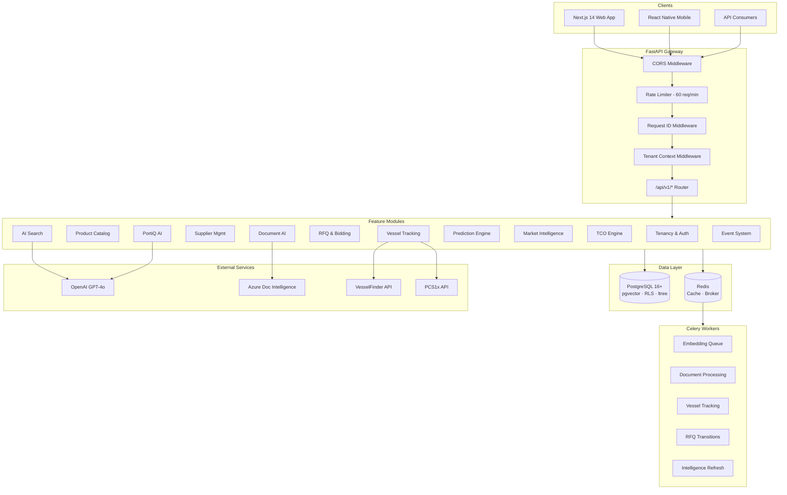

---

## Feature Modules

### 1. Multi-Tenancy & Authentication

**Module:** `src/modules/tenancy/`
**Purpose:** Organization-scoped data isolation with JWT authentication and role-based access control.

#### Features

| Feature | Description | Implementation |
|---------|-------------|----------------|
| JWT Authentication | HS256 token-based auth with 60-min expiry | `auth.py` — `get_current_user()` dependency |
| Organization Management | CRUD for buyer/supplier/platform organizations | `organization_service.py` |
| Membership Management | Invite, accept, role assignment, removal | `membership_service.py` |
| Role-Based Access Control | Permission checking per org type & role | `permissions.py` |
| Tenant Context Isolation | PostgreSQL RLS via session variables | `middleware.py` → `database/tenant.py` |
| Organization Switching | Switch active org context | Router endpoint `POST /switch-org/{org_id}` |

#### Data Model

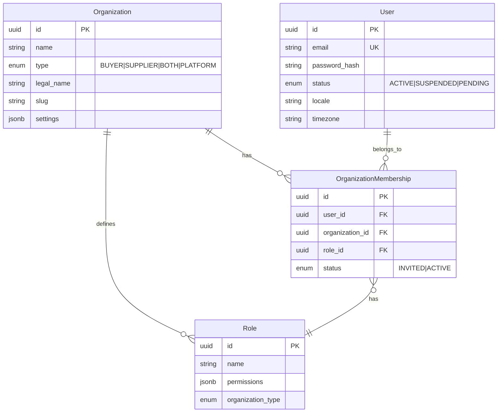

#### API Endpoints (15)

| Method | Path | Description |
|--------|------|-------------|
| POST | `/tenancy/organizations` | Create organization |
| GET | `/tenancy/organizations` | List user's organizations |
| GET | `/tenancy/organizations/{id}` | Get organization details |
| PATCH | `/tenancy/organizations/{id}` | Update organization |
| GET | `/tenancy/organizations/{id}/members` | List members |
| POST | `/tenancy/organizations/{id}/members/invite` | Invite member |
| POST | `/tenancy/organizations/{id}/members/accept` | Accept invitation |
| PATCH | `/tenancy/organizations/{id}/members/{uid}/role` | Update member role |
| DELETE | `/tenancy/organizations/{id}/members/{uid}` | Remove member |
| GET | `/tenancy/roles` | List roles |
| GET | `/tenancy/roles/{id}` | Get role |
| GET | `/tenancy/context` | Get current tenant context |
| POST | `/tenancy/switch-org/{id}` | Switch active organization |
| POST | `/tenancy/check-permission` | Check permission |

---

### 2. Product Catalog

**Module:** `src/modules/product/`
**Purpose:** Maritime product management with IMPA 6-digit codes, hierarchical categories, unit conversions, and catalog extensibility.

#### Features

| Feature | Description | Implementation |
|---------|-------------|----------------|
| IMPA Product Registry | Products identified by unique IMPA 6-digit codes | `service.py` — `ProductService` |
| Category Hierarchy | 34 IMPA categories with ltree paths + closure table | `category_service.py` |
| Catalog Extensibility | JSON Schema per category for custom attributes | `schema_registry.py` |
| Specification Validation | Validate product specs against category schema | `validators.py` |
| Unit Conversions | 26 units across quantity/volume/weight/length | `unit_service.py` |
| Supplier Product Mapping | Link suppliers to products with SKU, pricing, lead times | `service.py` |
| Price Brackets | Quantity-based pricing with validity periods | Model: `SupplierProductPrice` |
| Multi-Language Support | Product translations by locale | Model: `ProductTranslation` |
| Category Tags | RELATED, SUBSTITUTE, ACCESSORY cross-links | Model: `ProductCategoryTag` |
| IMPA/ISSA Mappings | Map industry codes to internal categories | `category_service.py` |

#### Category Hierarchy

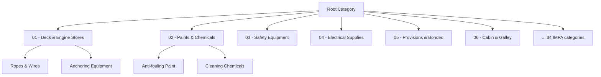

#### API Endpoints (39)

| Method | Path | Description |
|--------|------|-------------|
| POST | `/products` | Create product |
| GET | `/products` | List products (paginated, filtered) |
| POST | `/products/validate-impa` | Validate IMPA code |
| GET | `/products/impa/{code}` | Get product by IMPA code |
| GET | `/products/{id}` | Get product detail |
| PATCH | `/products/{id}` | Update product |
| DELETE | `/products/{id}` | Delete product |
| POST | `/products/{id}/suppliers` | Add supplier offering |
| GET | `/products/{id}/suppliers` | List supplier offerings |
| PATCH | `/products/{id}/suppliers/{sp_id}` | Update offering |
| POST | `/products/{id}/suppliers/{sp_id}/prices` | Add price bracket |
| GET | `/products/{id}/suppliers/{sp_id}/prices` | List prices |
| POST | `/products/{id}/tags` | Add category tag |
| GET | `/products/{id}/tags` | List tags |
| DELETE | `/products/{id}/tags/{tag_id}` | Remove tag |
| PUT | `/products/{id}/translations/{locale}` | Set translation |
| GET | `/products/{id}/translations` | List translations |
| POST | `/products/{id}/validate-specs` | Validate specs vs schema |
| POST | `/categories` | Create category |
| GET | `/categories` | List category tree |
| GET | `/categories/{id}` | Get category |
| GET | `/categories/{id}/tree` | Get subtree |
| GET | `/categories/{id}/breadcrumbs` | Get ancestor path |
| GET | `/categories/{id}/children` | Get direct children |
| PATCH | `/categories/{id}` | Update category |
| POST | `/categories/{id}/move` | Move to new parent |
| GET | `/categories/mappings/impa` | List IMPA mappings |
| GET | `/categories/mappings/issa` | List ISSA mappings |
| GET | `/categories/resolve/impa/{prefix}` | Resolve IMPA prefix |
| GET | `/categories/resolve/issa/{prefix}` | Resolve ISSA prefix |
| PUT | `/categories/mappings/impa/{prefix}` | Upsert IMPA mapping |
| PUT | `/categories/mappings/issa/{prefix}` | Upsert ISSA mapping |
| GET | `/categories/{id}/schema` | Get active schema |
| PUT | `/categories/{id}/schema` | Register schema version |
| GET | `/categories/{id}/schema/history` | Schema version history |
| GET | `/units` | List units of measure |
| POST | `/units/convert` | Convert between units |
| POST | `/units/conversions` | Create custom conversion |
| GET | `/units/conversions` | List conversions |

---

### 3. AI-Powered Search

**Module:** `src/modules/search/`
**Purpose:** Hybrid search combining semantic vectors, full-text, trigram fuzzy matching, and faceted filtering.

#### Features

| Feature | Description | Implementation |
|---------|-------------|----------------|
| Vector Search | pgvector cosine similarity on 1536-dim OpenAI embeddings | `service.py` — `VectorSearchService` |
| Full-Text Search | PostgreSQL TSVECTOR with ranking | `text_search.py` — `TextSearchService` |
| Fuzzy Search | pg_trgm trigram matching for typo tolerance | `text_search.py` |
| Hybrid Search | Combined vector + text scoring with configurable weights | `text_search.py` |
| Faceted Search | Category, hazmat, unit aggregations | `faceted_search.py` — `FacetedSearchService` |
| Autocomplete | Prefix-based suggestions | `text_search.py` |
| Synonym Management | Custom synonym terms for improved recall | Model: `SearchSynonym` |
| Batch Embedding Generation | Celery task for bulk vector computation | `tasks.py` |
| Line Item Matching | Match extracted text to closest product | `service.py` |

#### Search Architecture

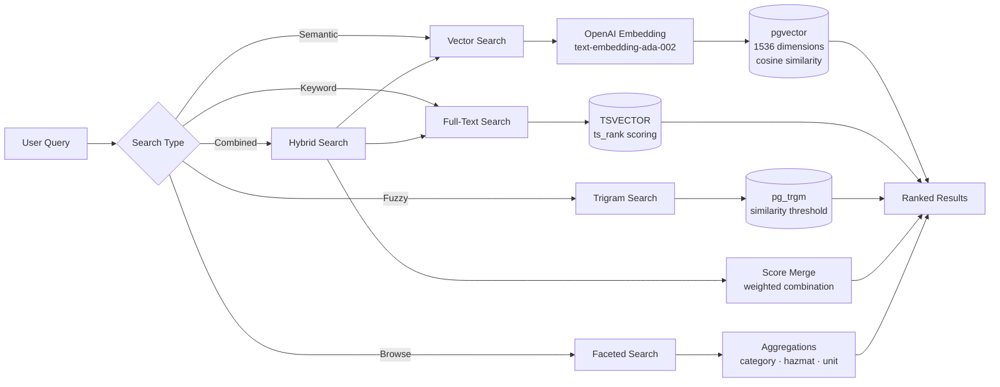

#### API Endpoints (8)

| Method | Path | Description |
|--------|------|-------------|
| POST | `/search/products` | pgvector semantic search |
| POST | `/search/match` | Match line item text to product |
| POST | `/search/embeddings/generate` | Queue batch embedding generation |
| GET | `/search/products/text` | Full-text / fuzzy / hybrid search |
| GET | `/search/suggest` | Autocomplete suggestions |
| GET | `/search/products/faceted` | Faceted search with aggregations |
| GET | `/search/synonyms` | List search synonyms |

---

### 4. Supplier Management & KYC

**Module:** `src/modules/supplier/`
**Purpose:** Supplier onboarding with tiered verification, KYC document management, and review workflows.

#### Features

| Feature | Description | Implementation |
|---------|-------------|----------------|
| Supplier Profiles | Company info, GST/PAN, address, port coverage | `onboarding_service.py` |
| KYC Document Upload | 10 document types with verification tracking | `onboarding_service.py` |
| Verification Workflow | Multi-step status machine (STARTED → APPROVED) | `onboarding_service.py` |
| Tier Management | 5-tier system (PENDING → PREMIUM) with capabilities | `constants.py` |
| Tier Upgrade Requests | Request + manual review for tier advancement | `review_service.py` |
| Review Audit Trail | Full history of review actions | Model: `SupplierReviewLog` |
| Admin Review Panel | Pending reviews, approve/reject, suspend | `review_service.py` |

#### Supplier Onboarding Flow

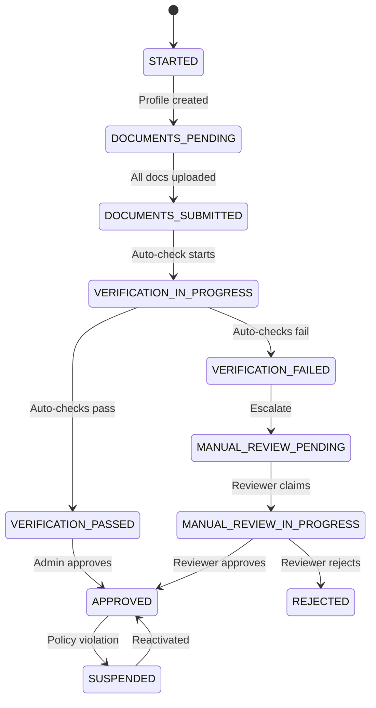

#### Supplier Tier System

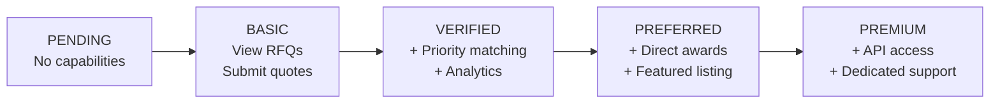

#### API Endpoints (14)

| Method | Path | Description |
|--------|------|-------------|
| POST | `/suppliers` | Create supplier profile |
| GET | `/suppliers` | List suppliers (filtered) |
| GET | `/suppliers/pending-reviews` | Pending reviews (admin) |
| GET | `/suppliers/{id}` | Get supplier profile |
| PATCH | `/suppliers/{id}` | Update supplier profile |
| POST | `/suppliers/{id}/documents` | Upload KYC document |
| GET | `/suppliers/{id}/documents` | List KYC documents |
| PATCH | `/suppliers/{id}/documents/{doc_id}` | Update document status |
| POST | `/suppliers/{id}/submit-for-verification` | Submit for verification |
| POST | `/suppliers/{id}/review` | Submit review (admin) |
| GET | `/suppliers/{id}/review-log` | Get review history |
| POST | `/suppliers/{id}/request-tier-upgrade` | Request tier upgrade |
| GET | `/suppliers/{id}/tier-capabilities` | Get tier capabilities |
| PUT | `/suppliers/{id}/status` | Update status (admin) |

---

### 5. Vessel Tracking & AIS

**Module:** `src/modules/vessel/`
**Purpose:** Real-time vessel tracking via AIS providers, port call management, and ETA computation.

#### Features

| Feature | Description | Implementation |
|---------|-------------|----------------|
| Vessel Registry | IMO/MMSI identification, type, specs, dimensions | `vessel_service.py` |
| AIS Position Tracking | Real-time lat/lng, speed, course, heading | `tracking_service.py` |
| Multi-Provider Support | VesselFinder + PCS1x with automatic failover | `providers/factory.py` |
| Port Call Management | Arrival/departure events with status tracking | `vessel_service.py` |
| ETA Computation | Estimated time of arrival at destination | `tracking_service.py` |
| Bulk Import | Admin batch vessel creation | Router endpoint |
| Provider Health Checks | Monitor AIS provider availability | Router endpoint |
| Signal Quality Validation | Max age, speed limits, confidence thresholds | Config: quality thresholds |

#### Vessel Tracking Architecture

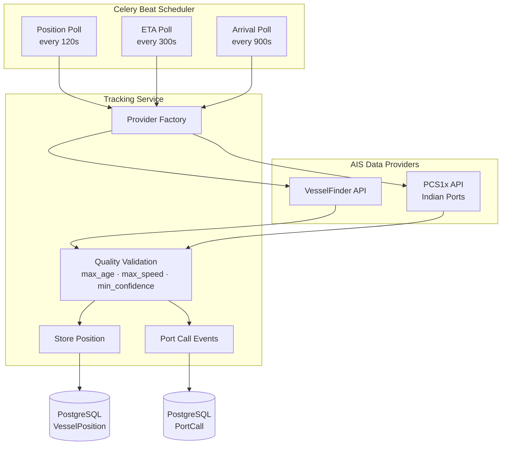

#### Port Call State Machine

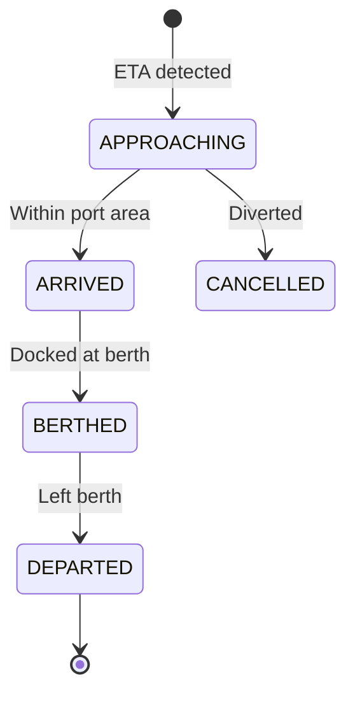

#### API Endpoints (15)

| Method | Path | Description |
|--------|------|-------------|
| POST | `/vessels` | Create vessel |
| GET | `/vessels` | List vessels |
| GET | `/vessels/{id}` | Get vessel details |
| PATCH | `/vessels/{id}` | Update vessel |
| DELETE | `/vessels/{id}` | Delete vessel |
| GET | `/vessels/by-imo/{imo}` | Get by IMO number |
| GET | `/vessels/{id}/positions` | Position history |
| POST | `/vessels/{id}/positions/track` | Trigger position update |
| GET | `/vessels/{id}/port-calls` | Port call history |
| GET | `/vessels/{id}/eta` | Get ETA |
| GET | `/vessels/port/{code}/arrivals` | Arrivals at port |
| POST | `/vessels/bulk-import` | Bulk import (admin) |
| GET | `/vessels/providers/health` | AIS provider health |

---

### 6. RFQ & Bidding Engine

**Module:** `src/modules/rfq/`
**Purpose:** Full Request for Quote lifecycle with state machine, supplier invitations, quote management, and award workflow.

#### Features

| Feature | Description | Implementation |
|---------|-------------|----------------|
| RFQ CRUD | Create, update, list with inline line items | `rfq_service.py` |
| State Machine | 8-state lifecycle with validated transitions | `rfq_service.py` |
| Line Item Management | Products by IMPA code, quantity, specs | `rfq_service.py` |
| Supplier Invitations | Invite, accept, decline with expiry | `rfq_service.py` |
| Quote Submission | Versioned quotes with line-item pricing | `quote_service.py` |
| Quote Comparison | Side-by-side evaluation | `quote_service.py` |
| Award Workflow | Award to winning supplier, notify others | `rfq_service.py` |
| Transition Audit Trail | Full history of state changes | Model: `RfqTransition` |
| Auto-Close | Celery beat task for expired RFQs | `celery_app.py` |
| Partial Bidding | Allow quotes on subset of line items | RFQ flag: `allow_partial_bids` |

#### RFQ State Machine

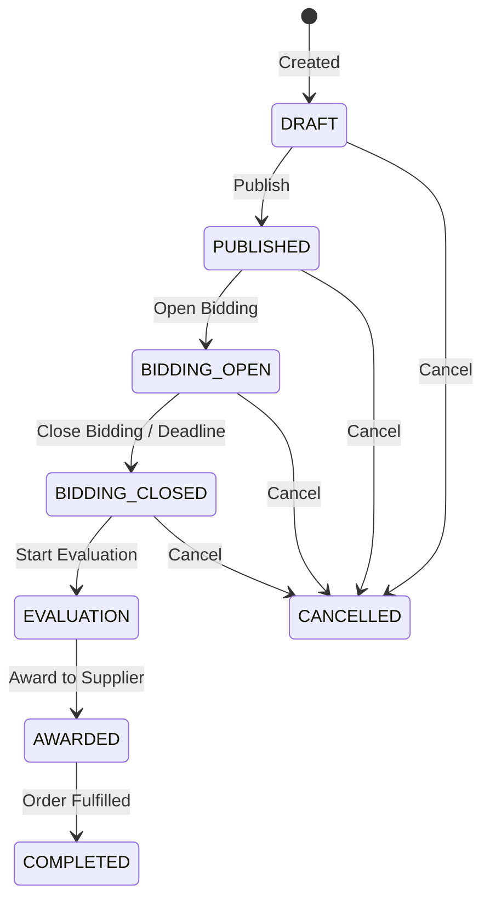

#### Quote Lifecycle

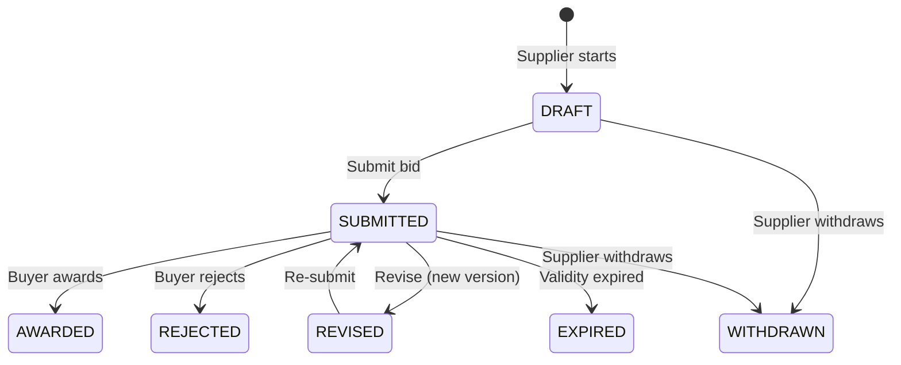

#### API Endpoints (24)

| Method | Path | Description |
|--------|------|-------------|
| POST | `/rfqs` | Create RFQ (with line items) |
| GET | `/rfqs` | List RFQs |
| GET | `/rfqs/{id}` | Get RFQ |
| PATCH | `/rfqs/{id}` | Update RFQ |
| POST | `/rfqs/{id}/publish` | Publish RFQ |
| POST | `/rfqs/{id}/line-items` | Add line item |
| PATCH | `/rfqs/{id}/line-items/{lid}` | Update line item |
| DELETE | `/rfqs/{id}/line-items/{lid}` | Delete line item |
| GET | `/rfqs/{id}/line-items` | List line items |
| POST | `/rfqs/{id}/invitations` | Invite supplier |
| GET | `/rfqs/{id}/invitations` | List invitations |
| POST | `/rfqs/{id}/invitations/{iid}/respond` | Respond to invitation |
| POST | `/rfqs/{id}/quotes` | Submit quote |
| GET | `/rfqs/{id}/quotes` | List quotes for RFQ |
| GET | `/quotes/{id}` | Get quote detail |
| PATCH | `/quotes/{id}` | Update quote |
| POST | `/quotes/{id}/withdraw` | Withdraw quote |
| POST | `/rfqs/{id}/award` | Award RFQ |
| POST | `/rfqs/{id}/cancel` | Cancel RFQ |
| GET | `/rfqs/{id}/transitions` | State transition history |

---

### 7. Document AI Pipeline

**Module:** `src/modules/document_ai/`
**Purpose:** Extract procurement data from uploaded documents (requisitions, POs, inventory lists) using Azure Document Intelligence with confidence-gated review.

#### Features

| Feature | Description | Implementation |
|---------|-------------|----------------|
| Document Upload & Extraction | Parse PDFs, images, handwritten forms | `extraction_service.py` |
| Azure DI Integration | Layout + Read models for document parsing | `extraction_service.py` |
| Line Item Normalization | Raw text → structured description, quantity, unit | `extraction_service.py` |
| Product Matching | Match extracted items to catalog via vector/keyword | `extraction_service.py` |
| Confidence-Gated Review | 3-tier routing based on match confidence | `extraction_service.py` |
| Duplicate Detection | Identify duplicate line items within extraction | `dedup_service.py` |
| Manual Verification | Human review of low-confidence matches | Router endpoint |
| RFQ Conversion | Convert verified extraction to RFQ line items | Router endpoint |
| Async Processing | Celery pipeline for background extraction | `tasks.py` |

#### Document AI Pipeline

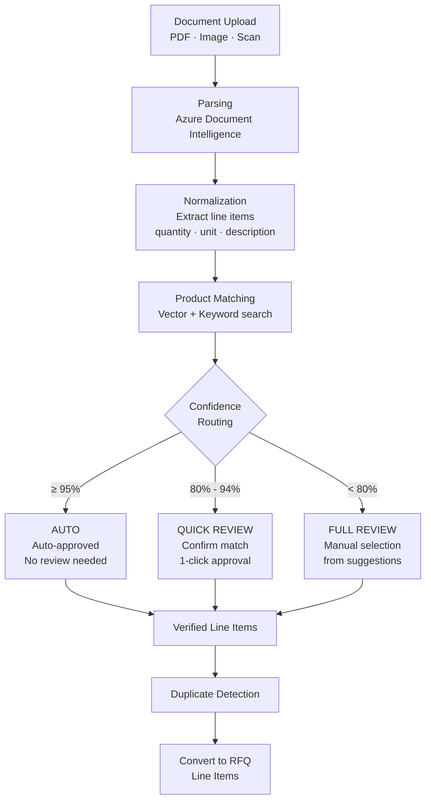

#### Supported Document Types

| Type | Description |
|------|-------------|
| `SYSTEM_REQUISITION` | Digital requisition from fleet management system |
| `PURCHASE_ORDER` | Existing purchase orders |
| `INVENTORY_LIST` | Current inventory/stock lists |
| `MAINTENANCE_EXPORT` | Planned maintenance system exports |
| `HANDWRITTEN_FORM` | Handwritten requisition forms |
| `MARKED_CATALOG` | Marked-up supplier catalogs |
| `NAMEPLATE_PHOTO` | Photos of equipment nameplates |
| `MIXED_FORM` | Mixed format documents |

#### API Endpoints (8)

| Method | Path | Description |
|--------|------|-------------|
| POST | `/documents/extract` | Upload and start extraction |
| GET | `/documents/extractions/{id}` | Get extraction status |
| GET | `/documents/extractions` | List extractions |
| PATCH | `/documents/extractions/{id}/line-items/{item_id}/verify` | Verify line item |
| POST | `/documents/extractions/{id}/deduplicate` | Detect duplicates |
| POST | `/documents/extractions/{id}/convert-to-rfq` | Convert to RFQ |

---

### 8. Prediction Engine

**Module:** `src/modules/prediction/`
**Purpose:** Predict vessel consumption patterns, generate procurement templates, and identify co-occurring items.

#### Features

| Feature | Description | Implementation |
|---------|-------------|----------------|
| Consumption Prediction | Predict quantities based on vessel type, crew, voyage | `consumption_engine.py` |
| Procurement Templates | Reusable templates by vessel type/route | `template_service.py` |
| Template Application | Apply template with quantity adjustments | `template_service.py` |
| Reorder Suggestions | Copy from previous RFQ with adjustments | `reorder_service.py` |
| Co-Occurrence Analysis | Frequently bought together items | `co_occurrence.py` |

#### Prediction Flow

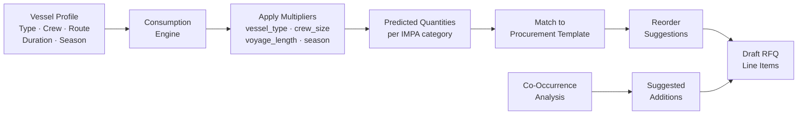

#### API Endpoints (6)

| Method | Path | Description |
|--------|------|-------------|
| POST | `/predictions/suggest` | Predict consumption quantities |
| GET | `/predictions/templates` | List procurement templates |
| POST | `/predictions/templates/apply` | Apply template |
| GET | `/predictions/reorder` | Get last order data |
| POST | `/predictions/reorder/copy` | Copy from RFQ with adjustments |
| POST | `/predictions/co-occurrences` | Find co-occurring items |

---

### 9. Market Intelligence

**Module:** `src/modules/intelligence/`
**Purpose:** Consolidated market intelligence including price benchmarks, supplier matching, risk analysis, and timing advice.

#### Features

| Feature | Description | Implementation |
|---------|-------------|----------------|
| Price Benchmarks | Percentile-based pricing (P25, P50, P75) over 90-day window | `price_benchmark_service.py` |
| Supplier Matching | Rank suppliers by coverage, tier, rating, port proximity | `supplier_matching.py` |
| Risk Analysis | Supply chain, timing, and geopolitical risk scoring | `risk_analyzer.py` |
| Timing Advice | Port congestion, seasonal demand, optimal ordering windows | `timing_advisor.py` |
| Consolidated Intelligence | Single endpoint combining all intelligence signals | Router: `GET /intelligence` |
| Materialized Views | Pre-computed benchmarks refreshed at 2AM UTC | Migration 013 |

#### Intelligence Architecture

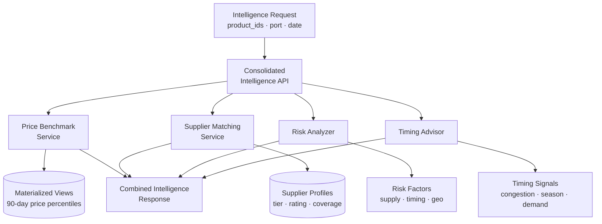

#### API Endpoints (5)

| Method | Path | Description |
|--------|------|-------------|
| GET | `/intelligence` | Consolidated intelligence (all signals) |
| GET | `/intelligence/price-benchmarks` | Price percentiles |
| GET | `/intelligence/suppliers` | Supplier matching & ranking |
| GET | `/intelligence/risks` | Risk analysis |
| GET | `/intelligence/timing` | Timing advice |

---

### 10. TCO (Total Cost of Ownership) Engine

**Module:** `src/modules/tco/`
**Purpose:** Multi-factor scoring system for comparing supplier quotes beyond unit price — incorporating shipping, lead time, quality, payment terms, and supplier rating.

#### Features

| Feature | Description | Implementation |
|---------|-------------|----------------|
| TCO Configurations | Organization-specific 6-factor weight profiles | `config_service.py` |
| Template Types | 6 presets: Commodity, Technical, Urgent, Strategic, Quality-Critical, Custom | Model: `TcoTemplateType` |
| TCO Calculation | Score quotes across all weighted factors | `engine.py` — `TcoEngineService` |
| Quote Comparison | Side-by-side TCO comparison for an RFQ | `comparison.py` — `QuoteComparisonService` |
| Split-Order Optimization | Optimal multi-supplier order splitting | `comparison.py` |
| Audit Trail | Full history of calculation actions | Model: `TcoAuditTrail` |

#### TCO Scoring Model

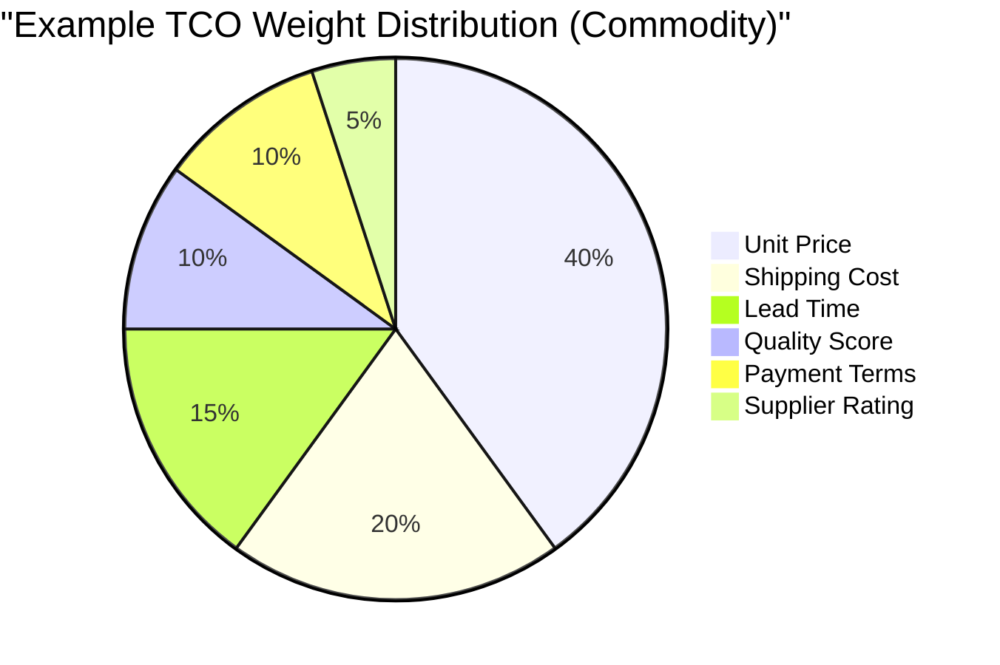

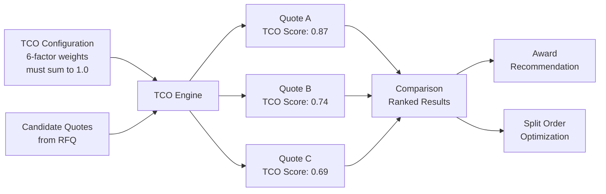

#### TCO Factors

| Factor | Description | Weight Range |
|--------|-------------|--------------|
| Unit Price | Base price per unit | 0.0 – 1.0 |
| Shipping Cost | Delivery/logistics cost | 0.0 – 1.0 |
| Lead Time | Days to delivery | 0.0 – 1.0 |
| Quality Score | Historical quality metrics | 0.0 – 1.0 |
| Payment Terms | Net days, early discount | 0.0 – 1.0 |
| Supplier Rating | Overall supplier performance | 0.0 – 1.0 |

#### API Endpoints (10+)

| Method | Path | Description |
|--------|------|-------------|
| POST | `/tco/configurations` | Create TCO configuration |
| GET | `/tco/configurations` | List configurations |
| GET | `/tco/configurations/{id}` | Get configuration |
| PATCH | `/tco/configurations/{id}` | Update configuration |
| POST | `/tco/calculate` | Calculate TCO for RFQ |
| GET | `/tco/calculations/{id}` | Get calculation result |
| POST | `/tco/compare-quotes` | Compare quotes by TCO |
| POST | `/tco/split-order` | Split order optimization |
| GET | `/tco/audit/{id}` | Get audit trail |

---

### 11. PortiQ AI Assistant

**Module:** `src/modules/portiq/`
**Purpose:** Conversation-first AI assistant powered by OpenAI GPT-4o with tool execution for procurement tasks.

#### Features

| Feature | Description | Implementation |
|---------|-------------|----------------|
| Chat Interface | Natural language conversation for procurement | `chat_service.py` |
| Session Management | Persistent conversation history (JSONB) | `session_service.py` |
| Tool Execution | AI can invoke platform APIs (search, create RFQ, etc.) | `tool_executor.py` |
| Action Execution | Execute AI-suggested actions with confirmation | Router: `POST /portiq/action` |
| Context-Aware | Understands user's organization, role, and permissions | `chat_service.py` |

#### PortiQ AI Architecture

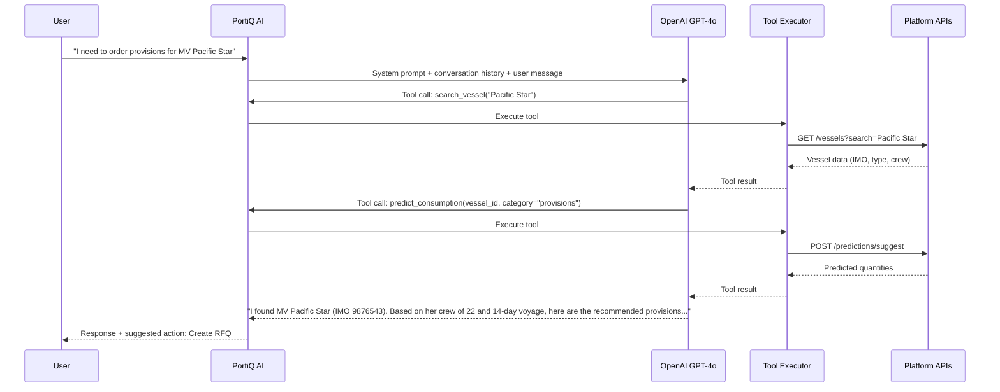

#### API Endpoints (3)

| Method | Path | Description |
|--------|------|-------------|
| POST | `/portiq/chat` | Chat with AI assistant |
| POST | `/portiq/action` | Execute AI-suggested action |
| GET | `/portiq/sessions/{id}/history` | Get conversation history |

---

### 12. Event System

**Module:** `src/modules/events/`
**Purpose:** Transactional outbox pattern for reliable event publishing with exactly-once delivery semantics.

#### Features

| Feature | Description | Implementation |
|---------|-------------|----------------|
| Event Outbox | Store events in DB before publishing | `outbox_service.py` |
| Exactly-Once Delivery | Idempotency keys for deduplication | Model: `ProcessedEvent` |
| Batch Processing | Poll and process events in configurable batches | Config: batch_size=50 |
| Status Tracking | PENDING → PROCESSING → COMPLETED / FAILED | Model: `EventOutbox` |

#### Event Outbox Pattern

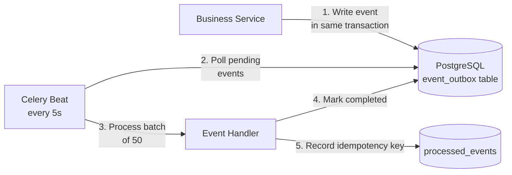

---

## Database Architecture

### Entity Relationship Overview

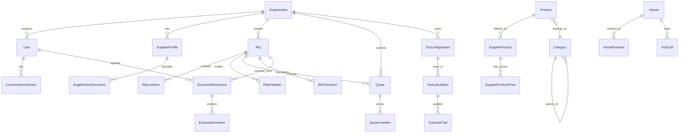

### PostgreSQL Extensions

| Extension | Purpose |
|-----------|---------|
| `pgvector` | 1536-dimension vector similarity search |
| `pg_trgm` | Trigram-based fuzzy text matching |
| `ltree` | Hierarchical category path queries |
| `uuid-ossp` | Server-side UUID generation |

### Row-Level Security (RLS)

All tenant-scoped tables enforce RLS via PostgreSQL session variables:

```
app.current_organization_id  → Organization filter
app.current_user_id          → User filter
app.current_organization_type → Type-based policies
app.admin_bypass             → Platform admin override
```

### Migration History (16 versions)

| # | Migration | Phase |
|---|-----------|-------|
| 001 | PostgreSQL extensions (pgvector, pg_trgm, ltree) | 0.1 |
| 002 | Core schema (products, orgs, users) | 0.1 |
| 003 | Custom PostgreSQL types | 0.1 |
| 004 | Row-Level Security policies | 0.1 |
| 005 | TSVECTOR search columns | 0.1 |
| 006 | Widen IMPA code columns | 0.1 |
| 007 | Catalog extensibility (JSON schemas) | 0.2 |
| 008 | Search enhancements (trigram indexes) | 0.2 |
| 009 | Multi-tenancy schema | 0.4 |
| 010 | Supplier onboarding & KYC | 1.1 |
| 011 | Vessel tracking & events | 1.1 |
| 012 | RFQ & bidding tables | 3.1 |
| 013 | Intelligence materialized views | 3.3 |
| 014 | Document extraction tables | 4.1 |
| 015 | TCO engine tables | 3.4 |
| 016 | Conversation session tables | 6.1 |

---

## API Architecture

### Route Structure

All endpoints are prefixed with `/api/v1/` and organized by module:

```
/api/v1/
├── /tenancy/                    15 endpoints — Auth & multi-tenancy
├── /products/                   22 endpoints — Product CRUD & offerings
├── /categories/                 17 endpoints — Hierarchy & mappings
├── /units/                       4 endpoints — Unit conversions
├── /search/                      8 endpoints — AI-powered search
├── /suppliers/                  14 endpoints — Onboarding & KYC
├── /vessels/                    15 endpoints — Tracking & AIS
├── /rfqs/                       20 endpoints — RFQ lifecycle
├── /quotes/                      4 endpoints — Quote management
├── /documents/                   8 endpoints — Document AI
├── /predictions/                 6 endpoints — Consumption prediction
├── /intelligence/                5 endpoints — Market intelligence
├── /tco/                        10 endpoints — TCO scoring
├── /portiq/                      3 endpoints — AI assistant
└── /health                       1 endpoint  — Health check
                            ─────────────────
                            ~152 total endpoints
```

### Middleware Pipeline

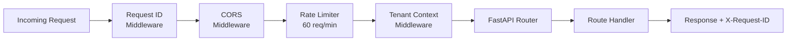

### Error Handling

| HTTP Code | Scenario |
|-----------|----------|
| 400 | Validation error (field-level details) |
| 401 | Missing or invalid JWT |
| 403 | Insufficient permissions |
| 404 | Resource not found |
| 409 | Business rule conflict |
| 422 | Request schema validation |
| 429 | Rate limit exceeded |
| 500 | Internal error (includes request_id) |

---

## Async Task Queue Architecture

### Celery Configuration

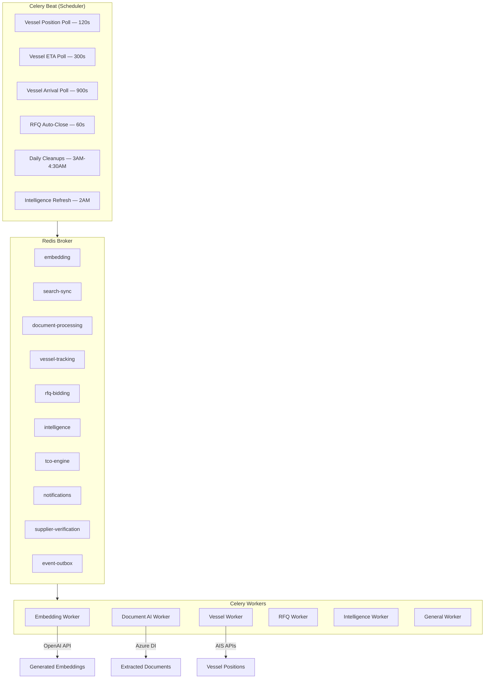

### Queue Routing

| Queue | Responsibilities |
|-------|-----------------|
| `embedding` | OpenAI embedding generation |
| `search-sync` | Search index synchronization |
| `document-processing` | Document AI extraction pipeline |
| `vessel-tracking` | AIS position polling |
| `rfq-bidding` | RFQ state transitions |
| `intelligence` | Materialized view refresh |
| `tco-engine` | TCO calculations |
| `notifications` | Email/push notifications |
| `supplier-verification` | KYC automated checks |
| `event-outbox` | Event outbox processing |

---

## Data Flow Diagrams

### End-to-End Procurement Flow

```mermaid
flowchart TB
    A[Ship Captain<br/>Uploads Requisition] --> B[Document AI<br/>Extract Line Items]
    B --> C{Confidence<br/>Check}
    C -->|≥95%| D[Auto-Approved]
    C -->|80-94%| E[Quick Review]
    C -->|<80%| F[Full Review]
    D & E & F --> G[Verified Line Items]

    G --> H[Prediction Engine<br/>Adjust Quantities]
    H --> I[Create RFQ<br/>Draft]

    I --> J[PortiQ AI<br/>Suggests Suppliers]
    J --> K[Intelligence<br/>Price Benchmarks]

    K --> L[Publish RFQ<br/>Invite Suppliers]
    L --> M[Suppliers<br/>Submit Quotes]

    M --> N[TCO Engine<br/>Score & Rank]
    N --> O[Award to<br/>Best Supplier]
    O --> P[Order<br/>Fulfilled]
```

### Vessel-Driven Procurement Trigger

```mermaid
flowchart LR
    AIS[AIS Position<br/>Update] --> TRACK[Tracking<br/>Service]
    TRACK --> APPROACH{Approaching<br/>Port?}
    APPROACH -->|Yes| PREDICT[Prediction<br/>Engine]
    PREDICT --> TEMPLATE[Apply<br/>Template]
    TEMPLATE --> DRAFT[Draft RFQ<br/>for Port]
    DRAFT --> NOTIFY[Notify<br/>Buyer]
    APPROACH -->|No| CONTINUE[Continue<br/>Monitoring]
```

---

## Technology Stack

| Layer | Technology | Purpose |
|-------|-----------|---------|
| **Backend Framework** | FastAPI | Async REST API |
| **Language** | Python 3.12+ | Backend logic |
| **ORM** | SQLAlchemy 2.0 (async) | Database access |
| **Database** | PostgreSQL 16+ | Primary data store |
| **Vector Search** | pgvector (1536-dim) | Semantic similarity |
| **Full-Text Search** | PostgreSQL TSVECTOR + pg_trgm | FTS + fuzzy |
| **Migrations** | Alembic | Schema versioning |
| **Task Queue** | Celery + Redis | Async processing |
| **Cache/Broker** | Redis | Caching & message broker |
| **AI/LLM** | OpenAI GPT-4o | Chat, embeddings |
| **Document AI** | Azure Document Intelligence | PDF/image parsing |
| **AIS Providers** | VesselFinder, PCS1x | Vessel tracking |
| **Auth** | JWT (HS256) via python-jose | Authentication |
| **Rate Limiting** | slowapi | Request throttling |
| **Validation** | Pydantic v2 | Request/response schemas |
| **Frontend** | Next.js 14 (App Router) | Web application |
| **UI Components** | shadcn/ui + Tailwind CSS | Design system |
| **State Management** | React Query + Zustand | Client state |
| **Mobile** | React Native + Expo | Mobile app |
| **Cloud** | AWS Mumbai (ap-south-1) | Infrastructure |
| **Linting** | Ruff | Code quality |
| **Type Checking** | MyPy (strict) | Static analysis |
| **Testing** | pytest + pytest-asyncio | Test framework |

---

## Phase Completion Status

| Phase | Name | Status |
|-------|------|--------|
| 0.1 | Database Core | Completed |
| 0.2 | API Infrastructure | Completed |
| 0.3 | Cloud & Auth | Deferred |
| 0.4 | Multi-Tenancy | Completed |
| 1.1 | Maritime Data Feeds (Vessel, Supplier) | Completed |
| 1.2 | ERP Integration | Planned |
| 2.1 | Prediction Engine | Completed |
| 2.2 | Co-Occurrence Analysis | Completed |
| 3.1 | RFQ & Bidding | Completed |
| 3.2 | Marketplace | Completed |
| 3.3 | Market Intelligence | Completed |
| 3.4 | TCO Engine | Completed |
| 4.1 | Document Extraction | Completed |
| 4.2 | Product Matching | Completed |
| 4.3 | Confidence Routing | Completed |
| 5.x | Finance (Invoice, TReDS) | Planned |
| 6.1 | PortiQ AI Chat | Completed |
| 6.2 | Tool Execution | Completed |
| 6.5 | Session Management | Completed |
| 6.6 | LLM Integration Tests | Completed |
| 7.x | Hardening (Security, Observability) | Planned |
| 8.x | Production Deployment | Planned |

---

*Generated from codebase analysis — PortiQ v0.1.0*
