# PortiQ Maritime Procurement Platform — Features & Architecture

## Table of Contents

- [Platform Overview](#platform-overview)
- [MVP1 vs Additional Features](#mvp1-vs-additional-features)
- [High-Level Architecture](#high-level-architecture)
- [System Architecture Diagram](#system-architecture-diagram)
- [End-to-End Value Chain](#end-to-end-value-chain)
- [Feature Modules](#feature-modules)
  - [1. Multi-Tenancy & Authentication](#1-multi-tenancy--authentication)
  - [2. Product Catalog](#2-product-catalog)
  - [3. AI-Powered Search](#3-ai-powered-search)
  - [4. Supplier Management & KYC](#4-supplier-management--kyc)
  - [5. Vessel Tracking & AIS](#5-vessel-tracking--ais)
  - [6. RFQ & Bidding Engine](#6-rfq--bidding-engine)
  - [7. Order Management](#7-order-management)
  - [8. Delivery & Proof-of-Delivery](#8-delivery--proof-of-delivery)
  - [9. Dispute Resolution](#9-dispute-resolution)
  - [10. Settlement & Invoicing](#10-settlement--invoicing)
  - [11. Data Export Service](#11-data-export-service)
  - [12. Basic Inventory](#12-basic-inventory)
  - [13. Document AI Pipeline](#13-document-ai-pipeline)
  - [14. Prediction Engine](#14-prediction-engine)
  - [15. Market Intelligence](#15-market-intelligence)
  - [16. TCO (Total Cost of Ownership) Engine](#16-tco-total-cost-of-ownership-engine)
  - [17. PortiQ AI Assistant](#17-portiq-ai-assistant)
  - [18. Event System](#18-event-system)
- [Post-Award UI](#post-award-ui)
- [Database Architecture](#database-architecture)
- [API Architecture](#api-architecture)
- [Async Task Queue Architecture](#async-task-queue-architecture)
- [Technology Stack](#technology-stack)
- [Phase Completion Status](#phase-completion-status)

---

## Platform Overview

PortiQ is a B2B maritime ship chandlery procurement platform targeting the **$95B global market**. It features an AI-native, conversation-first UX that transforms how ships procure supplies at port.

**Key differentiators:**
- IMPA 6-digit code based product identification (maritime industry standard)
- AI-powered document extraction from handwritten requisitions
- Confidence-gated review workflow (auto / quick review / full review)
- Predictive procurement based on vessel type, route, and consumption history
- Total Cost of Ownership scoring across 6 weighted factors
- Real-time vessel tracking via AIS providers
- End-to-end post-award flow: Order → Delivery → POD → Settlement → Export

---

## MVP1 vs Additional Features

### MVP1 Features (Core Value Chain)

The MVP1 covers the **complete procurement lifecycle** from port call setup through settlement and export.

| # | Feature | Module | Status | ADRs |
|---|---------|--------|--------|------|
| 1 | **Multi-Tenancy & Auth** | `tenancy/` | Built | FN-023, NF-018, NF-015 |
| 2 | **Product Catalog (IMPA)** | `product/` | Built | FN-001, FN-002, FN-004, FN-005 |
| 3 | **Supplier Onboarding & KYC** | `supplier/` | Built | FN-014, FN-015 |
| 4 | **Vessel Tracking & Port Calls** | `vessel/` | Built | FN-019, FN-020 |
| 5 | **RFQ & Bidding Engine** | `rfq/` | Built | FN-011, FN-012 |
| 6 | **Order Management** | `order/` | Planned (Phase 4.4) | FN-022 |
| 7 | **Delivery & Proof-of-Delivery** | `delivery/` | Planned (Phase 4.5) | FN-025 |
| 8 | **Dispute Resolution** | `dispute/` | Planned (Phase 4.6) | FN-026 |
| 9 | **Settlement & Invoicing** | `finance/` | Planned (Phase 5.3) | FN-027 |
| 10 | **Data Export (CSV/Excel/PDF)** | `export/` | Planned (Phase 5.4) | FN-028 |
| 11 | **Basic Inventory & Stock** | `inventory/` | Planned (Phase 3.5) | FN-029 |
| 12 | **Post-Award UI (Buyer + Supplier)** | `apps/web/` | Planned (Phase 6.7) | UI-017 |
| 13 | **Manual Port Call API** | `vessel/` | Planned (Quick Win) | — |

```
MVP1 Value Chain:

Port Call ──→ Requirements ──→ RFQ ──→ Quotes ──→ Award ──→ Order ──→ Delivery ──→ POD ──→ Settlement ──→ Export
   ▲              ▲             ▲        ▲          ▲        ▲         ▲           ▲         ▲             ▲
   │              │             │        │          │        │         │           │         │             │
   Built ─────────────────────────────────┘         │        └─────────────────────────────────────────────┘
                                                    │                    Planned (MVP1 Gap)
                                                    Built
```

### Additional Features (Built, Beyond MVP1 Scope)

These modules are already built but are **not required** for the core MVP1 pilot flow. They provide advanced platform capabilities.

| # | Feature | Module | Status | ADRs | Value |
|---|---------|--------|--------|------|-------|
| A1 | AI-Powered Semantic Search | `search/` | Built | NF-002, NF-003 | pgvector hybrid search |
| A2 | Document AI Pipeline | `document_ai/` | Built | FN-006–FN-010 | OCR + confidence review |
| A3 | Prediction Engine | `prediction/` | Built | FN-021 | Consumption forecasting |
| A4 | Market Intelligence | `intelligence/` | Built | — | Price benchmarks, risk analysis |
| A5 | TCO Scoring Engine | `tco/` | Built | FN-013 | 6-factor weighted comparison |
| A6 | PortiQ AI Assistant | `portiq/` | Built | — | GPT-4o chat with tool use |
| A7 | Event Outbox System | `events/` | Built | NF-009 | Exactly-once event delivery |

### Future Features (Not Yet Built)

| # | Feature | Phase | ADRs | Priority |
|---|---------|-------|------|----------|
| F1 | Embedded Finance | 5.1 | FN-016, FN-017 | P2 |
| F2 | TReDS Integration | 5.2 | FN-018 | P2 |
| F3 | Fleet ERP Integration | 1.2 | FN-024, FN-003 | P2 |
| F4 | Consumption Prediction ML | 2.3 | FN-021 | P3 |
| F5 | Mobile Foundation | 6.4 | UI-006, UI-007 | P1 |
| F6 | API Security & Hardening | 7.1–7.3 | NF-012–NF-020 | P1 |
| F7 | Event Architecture (Saga) | 8.1 | NF-009, NF-010 | P2 |
| F8 | Performance & Analytics | 8.2 | NF-004, NF-014 | P2 |
| F9 | Mobile Polish & Accessibility | 8.3 | UI-008, UI-010 | P3 |

---

## High-Level Architecture

```
┌─────────────────────────────────────────────────────────────┐
│                        CLIENTS                              │
│   Next.js 14 Web App  │  React Native Mobile  │  API Users │
└────────────┬──────────┴───────────┬───────────┴────────────┘
             │          HTTPS/REST  │
             ▼                      ▼
┌─────────────────────────────────────────────────────────────┐
│                    FastAPI Gateway                           │
│  ┌──────────┐ ┌──────────┐ ┌────────────┐ ┌─────────────┐  │
│  │ CORS     │ │ Rate     │ │ Tenant     │ │ Request ID  │  │
│  │ Middleware│ │ Limiter  │ │ Context    │ │ Middleware   │  │
│  └──────────┘ └──────────┘ └────────────┘ └─────────────┘  │
│                    /api/v1/* Router                          │
└────────────┬────────────────────────────────────────────────┘
             │
     ┌───────┴────────────────────────────────────┐
     ▼                                            ▼
┌──────────────────────┐             ┌──────────────────────┐
│   18 Feature Modules │             │   Celery Workers     │
│                      │             │   (14 Queues)        │
│  PRE-AWARD:          │             │                      │
│  • Tenancy           │ ┌────────┐  │  • Embeddings        │
│  • Product           │◄┤ Redis  ├─►│  • Document AI       │
│  • Search            │ │ Broker │  │  • Vessel Tracking   │
│  • Supplier          │ └────────┘  │  • RFQ Transitions   │
│  • Vessel            │             │  • Intelligence      │
│  • RFQ               │             │  • TCO Calculations  │
│                      │             │  • Notifications     │
│  POST-AWARD (MVP1):  │             │  • Export Processing │
│  • Order             │             │  • Dispute SLA       │
│  • Delivery          │             │  • Invoice Gen       │
│  • Dispute           │             │                      │
│  • Settlement        │             └──────────────────────┘
│  • Export            │
│  • Inventory         │
│                      │
│  ADDITIONAL:         │
│  • Document AI       │
│  • Prediction        │
│  • Intelligence      │
│  • TCO               │
│  • PortiQ AI         │
│  • Events            │
└────────┬─────────────┘
         │
    ┌────┴─────────────────────────────────┐
    ▼                                      ▼
┌──────────────────────┐    ┌──────────────────────────┐
│  PostgreSQL 16+      │    │  External Services       │
│                      │    │                          │
│  • pgvector (1536d)  │    │  • OpenAI (GPT-4o)       │
│  • pg_trgm (fuzzy)   │    │  • Azure Doc Intelligence│
│  • ltree (hierarchy) │    │  • VesselFinder AIS API  │
│  • RLS (tenancy)     │    │  • PCS1x AIS API (India) │
│  • TSVECTOR (FTS)    │    │  • AWS S3 (media/exports)│
│                      │    │                          │
└──────────────────────┘    └──────────────────────────┘
```

---

## System Architecture Diagram

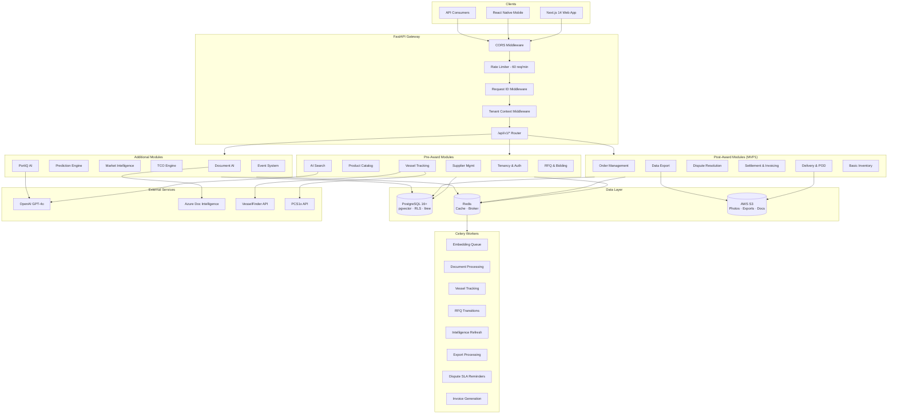

---

## End-to-End Value Chain

### Complete MVP1 Procurement Flow

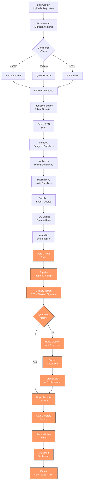

> Orange nodes = new post-award features being added for MVP1

### Vessel-Driven Procurement Trigger

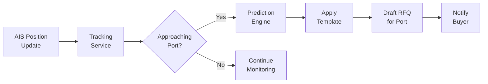

---

## Feature Modules

### 1. Multi-Tenancy & Authentication

**Module:** `src/modules/tenancy/` | **MVP1:** Yes | **Status:** Built

Organization-scoped data isolation with JWT authentication and role-based access control.

| Feature | Description | Implementation |
|---------|-------------|----------------|
| JWT Authentication | HS256 token-based auth with 60-min expiry | `auth.py` — `get_current_user()` dependency |
| Organization Management | CRUD for buyer/supplier/platform organizations | `organization_service.py` |
| Membership Management | Invite, accept, role assignment, removal | `membership_service.py` |
| Role-Based Access Control | Permission checking per org type & role | `permissions.py` |
| Tenant Context Isolation | PostgreSQL RLS via session variables | `middleware.py` → `database/tenant.py` |
| Organization Switching | Switch active org context | Router endpoint `POST /switch-org/{org_id}` |

**API Endpoints:** 15

---

### 2. Product Catalog

**Module:** `src/modules/product/` | **MVP1:** Yes | **Status:** Built

Maritime product management with IMPA 6-digit codes, hierarchical categories, unit conversions, and catalog extensibility.

| Feature | Description | Implementation |
|---------|-------------|----------------|
| IMPA Product Registry | Products identified by unique IMPA 6-digit codes | `service.py` — `ProductService` |
| Category Hierarchy | 34 IMPA categories with ltree paths + closure table | `category_service.py` |
| Catalog Extensibility | JSON Schema per category for custom attributes | `schema_registry.py` |
| Unit Conversions | 26 units across quantity/volume/weight/length | `unit_service.py` |
| Supplier Product Mapping | Link suppliers to products with SKU, pricing, lead times | `service.py` |
| Price Brackets | Quantity-based pricing with validity periods | Model: `SupplierProductPrice` |

**API Endpoints:** 39

---

### 3. AI-Powered Search

**Module:** `src/modules/search/` | **MVP1:** No (Additional) | **Status:** Built

Hybrid search combining semantic vectors, full-text, trigram fuzzy matching, and faceted filtering.

| Feature | Description | Implementation |
|---------|-------------|----------------|
| Vector Search | pgvector cosine similarity on 1536-dim OpenAI embeddings | `service.py` — `VectorSearchService` |
| Full-Text Search | PostgreSQL TSVECTOR with ranking | `text_search.py` — `TextSearchService` |
| Fuzzy Search | pg_trgm trigram matching for typo tolerance | `text_search.py` |
| Hybrid Search | Combined vector + text scoring with configurable weights | `text_search.py` |
| Faceted Search | Category, hazmat, unit aggregations | `faceted_search.py` |
| Autocomplete | Prefix-based suggestions | `text_search.py` |

**API Endpoints:** 8

---

### 4. Supplier Management & KYC

**Module:** `src/modules/supplier/` | **MVP1:** Yes | **Status:** Built

Supplier onboarding with tiered verification, KYC document management, and review workflows.

| Feature | Description | Implementation |
|---------|-------------|----------------|
| Supplier Profiles | Company info, GST/PAN, address, port coverage | `onboarding_service.py` |
| KYC Document Upload | 10 document types with verification tracking | `onboarding_service.py` |
| Verification Workflow | Multi-step status machine (STARTED → APPROVED) | `onboarding_service.py` |
| Tier Management | 5-tier system (PENDING → PREMIUM) with capabilities | `constants.py` |
| Admin Review Panel | Pending reviews, approve/reject, suspend | `review_service.py` |

#### Supplier Onboarding Flow

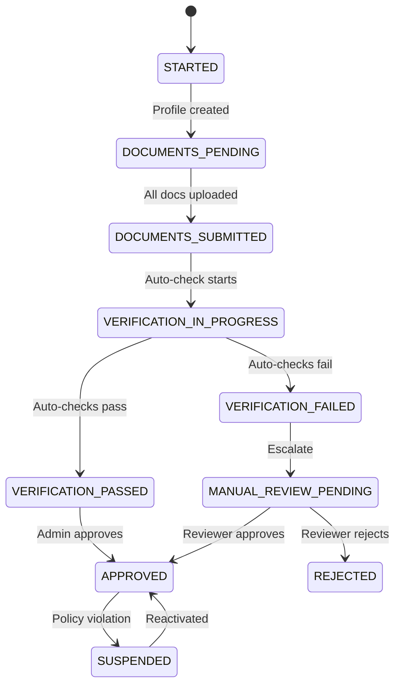

**API Endpoints:** 14

---

### 5. Vessel Tracking & AIS

**Module:** `src/modules/vessel/` | **MVP1:** Yes | **Status:** Built (Port Call API planned)

Real-time vessel tracking via AIS providers, port call management, and ETA computation.

| Feature | Description | Implementation |
|---------|-------------|----------------|
| Vessel Registry | IMO/MMSI identification, type, specs, dimensions | `vessel_service.py` |
| AIS Position Tracking | Real-time lat/lng, speed, course, heading | `tracking_service.py` |
| Multi-Provider Support | VesselFinder + PCS1x with automatic failover | `providers/factory.py` |
| Port Call Management | Arrival/departure events with status tracking | `vessel_service.py` |
| ETA Computation | Estimated time of arrival at destination | `tracking_service.py` |
| **Manual Port Call API** | **POST /port-calls for manual creation** | **Planned (Quick Win)** |

#### Port Call State Machine

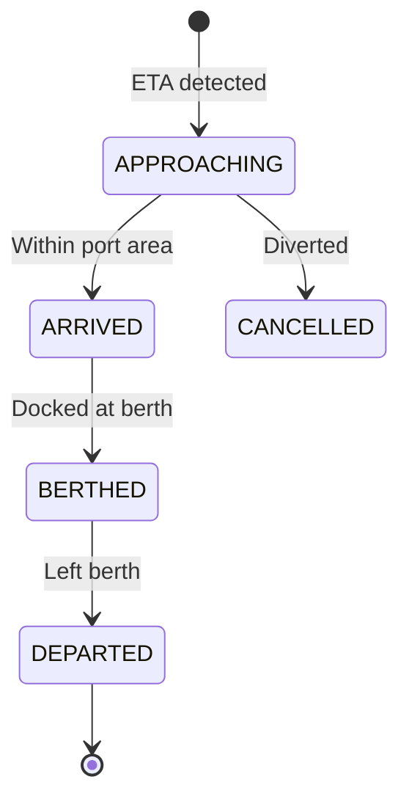

**API Endpoints:** 15 (+ 2 planned for manual port calls)

---

### 6. RFQ & Bidding Engine

**Module:** `src/modules/rfq/` | **MVP1:** Yes | **Status:** Built

Full Request for Quote lifecycle with state machine, supplier invitations, quote management, and award workflow.

| Feature | Description | Implementation |
|---------|-------------|----------------|
| RFQ CRUD | Create, update, list with inline line items | `rfq_service.py` |
| State Machine | 8-state lifecycle with validated transitions | `rfq_service.py` |
| Supplier Invitations | Invite, accept, decline with expiry | `rfq_service.py` |
| Quote Submission | Versioned quotes with line-item pricing | `quote_service.py` |
| Award Workflow | Award to winning supplier, notify others | `rfq_service.py` |
| Transition Audit Trail | Full history of state changes | Model: `RfqTransition` |

#### RFQ State Machine

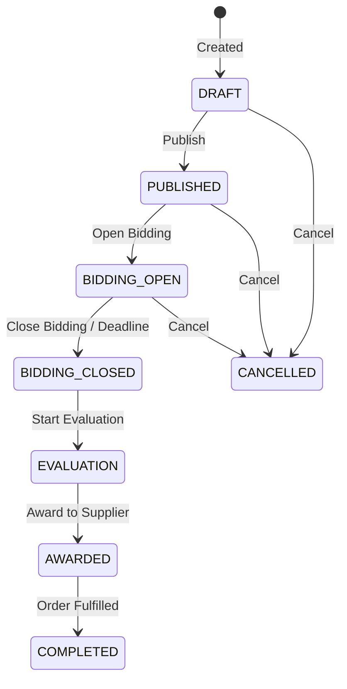

**API Endpoints:** 24

---

### 7. Order Management

**Module:** `src/modules/order/` | **MVP1:** Yes | **Status:** Planned (Phase 4.4)
**ADR:** [FN-022](../Ship/adr/functional/ADR-FN-022-order-lifecycle-fulfillment.md)

Hierarchical order lifecycle from RFQ award through fulfillment, with multi-vendor coordination and partial delivery support.

| Feature | Description |
|---------|-------------|
| Auto-Create from Award | Order auto-generated when RFQ is awarded |
| Hierarchical Model | Order → Vendor Orders → Fulfillments → Line Items |
| Status Rollup | Aggregate status computed from child entities |
| Partial Fulfillment | Support for split shipments and partial quantities |
| Cancellation Matrix | Rules by status and initiator with penalty tracking |
| Transition Audit Trail | All state changes logged |

#### Order Model Hierarchy

```
ORDER (ORD-2026-001234)
├── VENDOR ORDER (Supplier A) — status: FULFILLED
│   ├── Fulfillment #1 — status: DELIVERED
│   │   ├── Line Item: IMPA 123456 × 100 units ✓
│   │   └── Line Item: IMPA 234567 × 50 units ✓
│   └── (no more fulfillments)
└── VENDOR ORDER (Supplier B) — status: IN_TRANSIT
    ├── Fulfillment #1 — status: DELIVERED (partial)
    │   └── Line Item: IMPA 345678 × 30 of 50 units
    └── Fulfillment #2 — status: IN_TRANSIT (remaining)
        ├── Line Item: IMPA 345678 × 20 units
        └── Line Item: IMPA 456789 × 75 units
```

#### Order Status Machine

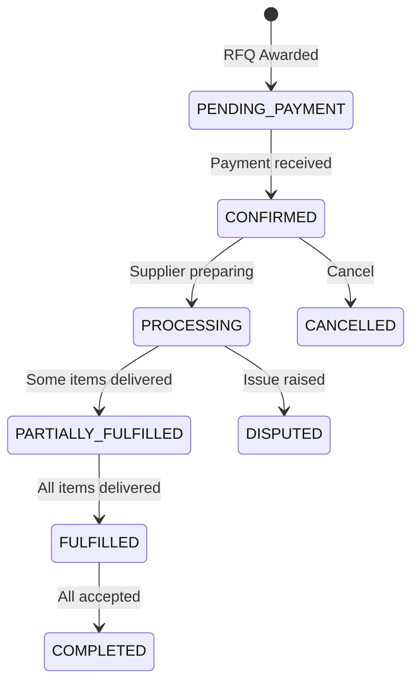

**Models:** `orders`, `vendor_orders`, `fulfillments`, `fulfillment_items`, `order_line_items`
**API Endpoints:** ~15

---

### 8. Delivery & Proof-of-Delivery

**Module:** `src/modules/delivery/` | **MVP1:** Yes | **Status:** Planned (Phase 4.5)
**ADR:** [FN-025](../Ship/adr/functional/ADR-FN-025-delivery-proof-of-delivery.md)

Delivery tracking with GPS coordinates, photo evidence, digital signatures, and SLA monitoring for maritime port deliveries.

| Feature | Description |
|---------|-------------|
| GPS Capture | Browser Geolocation API for delivery coordinates |
| Photo Evidence | S3-backed photos of delivered goods (presigned upload) |
| Digital Signature | Canvas-based signature capture stored as PNG in S3 |
| Quantity Verification | Line-item level: expected vs delivered vs accepted |
| SLA Tracking | On-time vs delayed with configurable per buyer-supplier pair |
| Dispute Flagging | Immediate dispute creation for discrepancies |

#### Delivery Flow

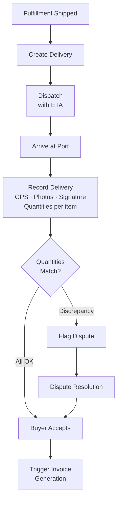

**Models:** `deliveries`, `delivery_items`, `delivery_photos`, `delivery_sla_configs`
**API Endpoints:** 9

---

### 9. Dispute Resolution

**Module:** `src/modules/dispute/` | **MVP1:** Yes | **Status:** Planned (Phase 4.6)
**ADR:** [FN-026](../Ship/adr/functional/ADR-FN-026-dispute-resolution-workflow.md)

Structured dispute workflow with state machine, comment trail, evidence attachments, and financial outcome tracking.

| Feature | Description |
|---------|-------------|
| State Machine | OPEN → UNDER_REVIEW → RESOLVED / ESCALATED |
| Dispute Types | Quantity shortage, quality issue, wrong product, damaged, price, late delivery |
| Comment Trail | Threaded comments with S3-backed file attachments |
| Financial Outcomes | Credit note, refund, replacement, price adjustment |
| SLA Enforcement | Response due dates with auto-escalation on breach |
| Transition Audit | Every status change logged with actor and reason |

#### Dispute State Machine

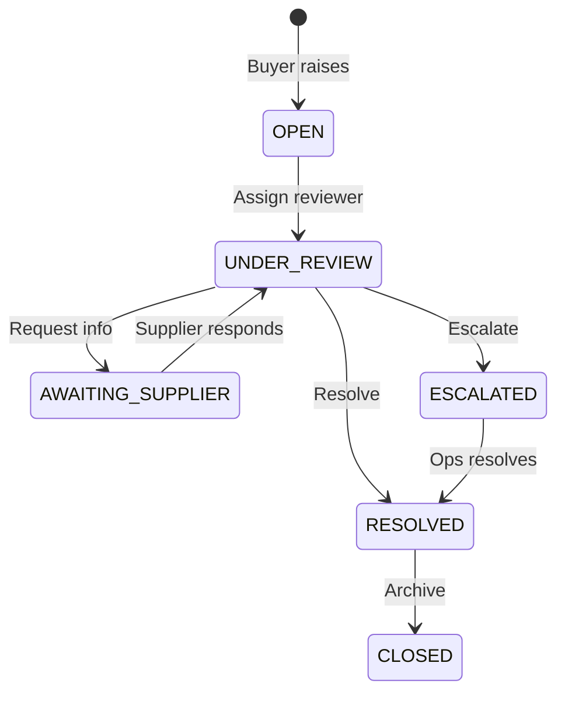

**Models:** `disputes`, `dispute_comments`, `dispute_transitions`
**API Endpoints:** 7

---

### 10. Settlement & Invoicing

**Module:** `src/modules/finance/` | **MVP1:** Yes | **Status:** Planned (Phase 5.3)
**ADR:** [FN-027](../Ship/adr/functional/ADR-FN-027-settlement-invoice-generation.md)

Auto-generated invoices from delivery acceptance with reconciliation views and settlement period aggregation.

| Feature | Description |
|---------|-------------|
| Auto-Generation | Invoice auto-created when delivery is accepted |
| Reconciliation | Ordered vs delivered vs accepted vs invoiced comparison |
| Credit Adjustments | Dispute resolutions reduce invoice amount automatically |
| Invoice Workflow | DRAFT → READY → SENT → ACKNOWLEDGED → PAID |
| Settlement Periods | Aggregate by port call, weekly, or monthly |
| Future-Ready | Data structure supports FN-016/FN-017 finance integration |

#### Invoice Generation Flow

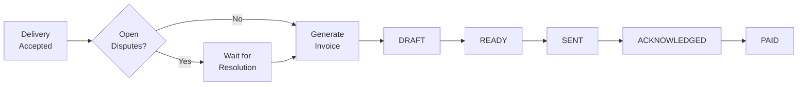

**Models:** `invoices`, `invoice_line_items`, `settlement_periods`
**API Endpoints:** 8

---

### 11. Data Export Service

**Module:** `src/modules/export/` | **MVP1:** Yes | **Status:** Planned (Phase 5.4)
**ADR:** [FN-028](../Ship/adr/functional/ADR-FN-028-data-export-service.md)

CSV, Excel, and PDF export with async processing for large datasets and S3 storage.

| Feature | Description |
|---------|-------------|
| CSV Export | Stdlib `csv` module, streaming for small datasets |
| Excel Export | `openpyxl` with formatted sheets and multiple tabs |
| PDF Export | `weasyprint` HTML-to-PDF with invoice templates |
| Async Processing | Celery tasks for large exports (>1000 rows) |
| S3 Storage | Generated files stored in S3 with 7-day TTL |
| Presigned Downloads | Secure time-limited download URLs |

**Models:** `export_jobs`
**API Endpoints:** 4

---

### 12. Basic Inventory

**Module:** `src/modules/inventory/` | **MVP1:** Yes | **Status:** Planned (Phase 3.5)
**ADR:** [FN-029](../Ship/adr/functional/ADR-FN-029-basic-inventory-stock-levels.md)

Simple stock level tracking per supplier per product with movement audit log and low-stock alerting.

| Feature | Description |
|---------|-------------|
| Stock Levels | Per-supplier per-product current quantities |
| Movement Audit | Every change (manual, delivery deduction, restock) logged |
| Auto-Deduction | Stock decremented on delivery acceptance |
| Low-Stock Alerts | Configurable reorder points with notifications |
| Bulk Update | CSV or JSON batch import for stock levels |
| Supplier Matching | Feeds into RFQ routing intelligence |

#### Auto-Deduction Flow

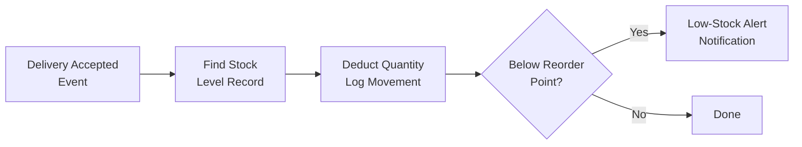

**Models:** `stock_levels`, `stock_movements`
**API Endpoints:** 5

---

### 13. Document AI Pipeline

**Module:** `src/modules/document_ai/` | **MVP1:** No (Additional) | **Status:** Built

Extract procurement data from uploaded documents using Azure Document Intelligence with confidence-gated review.

| Feature | Description | Implementation |
|---------|-------------|----------------|
| Document Upload & Extraction | Parse PDFs, images, handwritten forms | `extraction_service.py` |
| Azure DI Integration | Layout + Read models for document parsing | `extraction_service.py` |
| Line Item Normalization | Raw text → structured description, quantity, unit | `extraction_service.py` |
| Product Matching | Match extracted items to catalog via vector/keyword | `extraction_service.py` |
| Confidence-Gated Review | 3-tier routing based on match confidence | `extraction_service.py` |
| Duplicate Detection | Identify duplicate line items within extraction | `dedup_service.py` |

#### Confidence Routing

```
≥ 95% confidence  →  AUTO (no review needed)
80% - 94%          →  QUICK REVIEW (1-click approval)
< 80%              →  FULL REVIEW (manual selection)
```

**API Endpoints:** 8

---

### 14. Prediction Engine

**Module:** `src/modules/prediction/` | **MVP1:** No (Additional) | **Status:** Built

Predict vessel consumption patterns, generate procurement templates, and identify co-occurring items.

| Feature | Description | Implementation |
|---------|-------------|----------------|
| Consumption Prediction | Predict quantities based on vessel type, crew, voyage | `consumption_engine.py` |
| Procurement Templates | Reusable templates by vessel type/route | `template_service.py` |
| Reorder Suggestions | Copy from previous RFQ with adjustments | `reorder_service.py` |
| Co-Occurrence Analysis | Frequently bought together items | `co_occurrence.py` |

**API Endpoints:** 6

---

### 15. Market Intelligence

**Module:** `src/modules/intelligence/` | **MVP1:** No (Additional) | **Status:** Built

Consolidated market intelligence including price benchmarks, supplier matching, risk analysis, and timing advice.

| Feature | Description | Implementation |
|---------|-------------|----------------|
| Price Benchmarks | Percentile-based pricing (P25, P50, P75) over 90-day window | `price_benchmark_service.py` |
| Supplier Matching | Rank suppliers by coverage, tier, rating, port proximity | `supplier_matching.py` |
| Risk Analysis | Supply chain, timing, and geopolitical risk scoring | `risk_analyzer.py` |
| Timing Advice | Port congestion, seasonal demand, optimal ordering windows | `timing_advisor.py` |

**API Endpoints:** 5

---

### 16. TCO (Total Cost of Ownership) Engine

**Module:** `src/modules/tco/` | **MVP1:** No (Additional) | **Status:** Built

Multi-factor scoring system for comparing supplier quotes beyond unit price.

| Factor | Description | Weight Range |
|--------|-------------|--------------|
| Unit Price | Base price per unit | 0.0 – 1.0 |
| Shipping Cost | Delivery/logistics cost | 0.0 – 1.0 |
| Lead Time | Days to delivery | 0.0 – 1.0 |
| Quality Score | Historical quality metrics | 0.0 – 1.0 |
| Payment Terms | Net days, early discount | 0.0 – 1.0 |
| Supplier Rating | Overall supplier performance | 0.0 – 1.0 |

**API Endpoints:** 10

---

### 17. PortiQ AI Assistant

**Module:** `src/modules/portiq/` | **MVP1:** No (Additional) | **Status:** Built

Conversation-first AI assistant powered by OpenAI GPT-4o with tool execution for procurement tasks.

| Feature | Description | Implementation |
|---------|-------------|----------------|
| Chat Interface | Natural language conversation for procurement | `chat_service.py` |
| Session Management | Persistent conversation history (JSONB) | `session_service.py` |
| Tool Execution | AI can invoke platform APIs (search, create RFQ, etc.) | `tool_executor.py` |
| Context-Aware | Understands user's organization, role, and permissions | `chat_service.py` |

**API Endpoints:** 3

---

### 18. Event System

**Module:** `src/modules/events/` | **MVP1:** No (Additional) | **Status:** Built

Transactional outbox pattern for reliable event publishing with exactly-once delivery semantics.

| Feature | Description | Implementation |
|---------|-------------|----------------|
| Event Outbox | Store events in DB before publishing | `outbox_service.py` |
| Exactly-Once Delivery | Idempotency keys for deduplication | Model: `ProcessedEvent` |
| Batch Processing | Poll and process events in configurable batches | Config: batch_size=50 |
| Status Tracking | PENDING → PROCESSING → COMPLETED / FAILED | Model: `EventOutbox` |

**API Endpoints:** 0 (internal only)

---

## Post-Award UI

**ADR:** [UI-017](../Ship/adr/ui/ADR-UI-017-post-award-operational-ui.md) | **Phase:** 6.7 | **Status:** Planned

~15 new pages across buyer and supplier portals following the existing Next.js App Router pattern.

### Buyer Pages (`apps/web/app/(dashboard)/`)

| Route | Page | Data Source |
|-------|------|-------------|
| `/orders` | Order List | FN-022 |
| `/orders/[id]` | Order Detail with vendor orders and fulfillments | FN-022 |
| `/deliveries` | Delivery List | FN-025 |
| `/deliveries/[id]` | Delivery Detail with POD evidence | FN-025 |
| `/deliveries/[id]/accept` | Delivery Acceptance with quantity verification | FN-025, FN-026 |
| `/invoices` | Invoice List | FN-027 |
| `/invoices/[id]` | Invoice Detail with reconciliation view | FN-027 |
| `/disputes` | Dispute List | FN-026 |
| `/disputes/[id]` | Dispute Detail with comment trail | FN-026 |
| `/settlements` | Settlement Dashboard with export | FN-027, FN-028 |

### Supplier Pages (`apps/web/app/(supplier)/supplier/`)

| Route | Page | Data Source |
|-------|------|-------------|
| `/orders` | Order List (replaces "Coming Soon") | FN-022 |
| `/orders/[id]` | Order Detail, prepare fulfillment | FN-022 |
| `/deliveries` | Delivery List | FN-025 |
| `/deliveries/[id]/submit` | Delivery Submission (mobile-first: GPS, photos, signature) | FN-025 |
| `/inventory` | Inventory Dashboard with low-stock alerts | FN-029 |
| `/invoices` | Invoice List and payment status | FN-027 |

### Key UI Components (Shared)

| Component | Purpose |
|-----------|---------|
| `StatusBadge` | Colored badge for entity status |
| `QuantityComparison` | Ordered vs delivered vs accepted |
| `TimelineTracker` | Visual status progression |
| `PhotoGallery` | Delivery photos with lightbox |
| `SignatureCanvas` | HTML5 canvas for signature capture |
| `GPSCapture` | Geolocation with accuracy display |
| `ReconciliationTable` | Three-column comparison table |
| `ExportButton` | Export with format selector |
| `DisputeThread` | Comment trail with attachments |

---

## Database Architecture

### Entity Relationship Overview

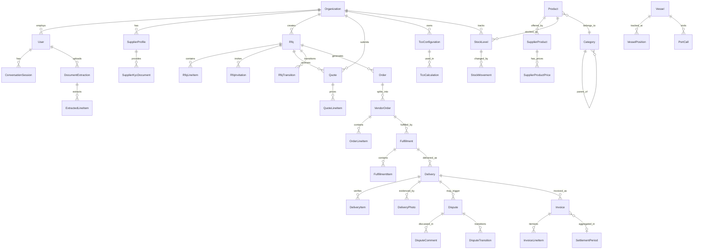

### PostgreSQL Extensions

| Extension | Purpose |
|-----------|---------|
| `pgvector` | 1536-dimension vector similarity search |
| `pg_trgm` | Trigram-based fuzzy text matching |
| `ltree` | Hierarchical category path queries |
| `uuid-ossp` | Server-side UUID generation |

### Row-Level Security (RLS)

All tenant-scoped tables enforce RLS via PostgreSQL session variables:

```
app.current_organization_id  → Organization filter
app.current_user_id          → User filter
app.current_organization_type → Type-based policies
app.admin_bypass             → Platform admin override
```

### Migration History

| # | Migration | Phase | Status |
|---|-----------|-------|--------|
| 001 | PostgreSQL extensions (pgvector, pg_trgm, ltree) | 0.1 | Done |
| 002 | Core schema (products, orgs, users) | 0.1 | Done |
| 003 | Custom PostgreSQL types | 0.1 | Done |
| 004 | Row-Level Security policies | 0.1 | Done |
| 005 | TSVECTOR search columns | 0.1 | Done |
| 006 | Widen IMPA code columns | 0.1 | Done |
| 007 | Catalog extensibility (JSON schemas) | 0.2 | Done |
| 008 | Search enhancements (trigram indexes) | 0.2 | Done |
| 009 | Multi-tenancy schema | 0.4 | Done |
| 010 | Supplier onboarding & KYC | 1.1 | Done |
| 011 | Vessel tracking & events | 1.1 | Done |
| 012 | RFQ & bidding tables | 3.1 | Done |
| 013 | Intelligence materialized views | 3.3 | Done |
| 014 | Document extraction tables | 4.1 | Done |
| 015 | TCO engine tables | 3.4 | Done |
| 016 | Conversation session tables | 6.1 | Done |
| 017 | Order management (orders, vendor_orders, fulfillments, line items) | 4.4 | Planned |
| 018 | Delivery & POD (deliveries, photos, SLA configs) | 4.5 | Planned |
| 019 | Dispute resolution (disputes, comments, transitions) | 4.6 | Planned |
| 020 | Settlement & invoicing (invoices, line items, settlement periods) | 5.3 | Planned |
| 021 | Data export (export_jobs) | 5.4 | Planned |
| 022 | Inventory (stock_levels, stock_movements) | 3.5 | Planned |

---

## API Architecture

### Route Structure

All endpoints are prefixed with `/api/v1/` and organized by module:

```
/api/v1/
├── /tenancy/                    15 endpoints — Auth & multi-tenancy
├── /products/                   22 endpoints — Product CRUD & offerings
├── /categories/                 17 endpoints — Hierarchy & mappings
├── /units/                       4 endpoints — Unit conversions
├── /search/                      8 endpoints — AI-powered search
├── /suppliers/                  14 endpoints — Onboarding & KYC
├── /vessels/                    15 endpoints — Tracking & AIS (+2 planned)
├── /rfqs/                       20 endpoints — RFQ lifecycle
├── /quotes/                      4 endpoints — Quote management
├── /documents/                   8 endpoints — Document AI
├── /predictions/                 6 endpoints — Consumption prediction
├── /intelligence/                5 endpoints — Market intelligence
├── /tco/                        10 endpoints — TCO scoring
├── /portiq/                      3 endpoints — AI assistant
├── /health                       1 endpoint  — Health check
│                           ─────────────────
│                           ~152 existing endpoints
│
│   PLANNED (MVP1 Post-Award):
├── /orders/                    ~15 endpoints — Order lifecycle
├── /deliveries/                  9 endpoints — Delivery & POD
├── /disputes/                    7 endpoints — Dispute resolution
├── /invoices/                    8 endpoints — Invoice & settlement
├── /exports/                     4 endpoints — Data export
├── /inventory/                   5 endpoints — Stock levels
├── /port-calls/                  2 endpoints — Manual port calls
│                           ─────────────────
│                           ~50 new endpoints
│
│                           ═════════════════
│                           ~202 total endpoints
```

### Middleware Pipeline

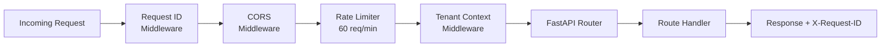

### Error Handling

| HTTP Code | Scenario |
|-----------|----------|
| 400 | Validation error (field-level details) |
| 401 | Missing or invalid JWT |
| 403 | Insufficient permissions |
| 404 | Resource not found |
| 409 | Business rule conflict |
| 422 | Request schema validation |
| 429 | Rate limit exceeded |
| 500 | Internal error (includes request_id) |

---

## Async Task Queue Architecture

### Celery Configuration

```mermaid
flowchart TB
    subgraph Beat["Celery Beat (Scheduler)"]
        B1[Vessel Position Poll — 120s]
        B2[Vessel ETA Poll — 300s]
        B3[Vessel Arrival Poll — 900s]
        B4[RFQ Auto-Close — 60s]
        B5[Daily Cleanups — 3AM-4:30AM]
        B6[Intelligence Refresh — 2AM]
        B7[Dispute SLA Check — 300s]
        B8[Export Cleanup — 6AM daily]
    end

    subgraph Broker["Redis Broker"]
        Q1[embedding]
        Q2[search-sync]
        Q3[document-processing]
        Q4[vessel-tracking]
        Q5[rfq-bidding]
        Q6[intelligence]
        Q7[tco-engine]
        Q8[notifications]
        Q9[supplier-verification]
        Q10[event-outbox]
        Q11[export-processing]
        Q12[invoice-generation]
        Q13[dispute-sla]
        Q14[inventory-sync]
    end

    subgraph Workers["Celery Workers"]
        W1[Embedding Worker]
        W2[Document AI Worker]
        W3[Vessel Worker]
        W4[RFQ Worker]
        W5[Intelligence Worker]
        W6[General Worker]
        W7[Export Worker]
        W8[Post-Award Worker]
    end

    Beat --> Broker
    Broker --> Workers
```

### Queue Routing

| Queue | Responsibilities | MVP1? |
|-------|-----------------|-------|
| `embedding` | OpenAI embedding generation | Additional |
| `search-sync` | Search index synchronization | Additional |
| `document-processing` | Document AI extraction pipeline | Additional |
| `vessel-tracking` | AIS position polling | Yes |
| `rfq-bidding` | RFQ state transitions | Yes |
| `intelligence` | Materialized view refresh | Additional |
| `tco-engine` | TCO calculations | Additional |
| `notifications` | Email/push notifications | Yes |
| `supplier-verification` | KYC automated checks | Yes |
| `event-outbox` | Event outbox processing | Additional |
| `export-processing` | CSV/Excel/PDF generation | Yes (Planned) |
| `invoice-generation` | Auto-generate invoices from delivery | Yes (Planned) |
| `dispute-sla` | SLA monitoring and auto-escalation | Yes (Planned) |
| `inventory-sync` | Stock level auto-deduction | Yes (Planned) |

---

## Technology Stack

| Layer | Technology | Purpose |
|-------|-----------|---------|
| **Backend Framework** | FastAPI | Async REST API |
| **Language** | Python 3.12+ | Backend logic |
| **ORM** | SQLAlchemy 2.0 (async) | Database access |
| **Database** | PostgreSQL 16+ | Primary data store |
| **Vector Search** | pgvector (1536-dim) | Semantic similarity |
| **Full-Text Search** | PostgreSQL TSVECTOR + pg_trgm | FTS + fuzzy |
| **Migrations** | Alembic | Schema versioning |
| **Task Queue** | Celery + Redis | Async processing |
| **Cache/Broker** | Redis | Caching & message broker |
| **Object Storage** | AWS S3 | Photos, exports, documents |
| **AI/LLM** | OpenAI GPT-4o | Chat, embeddings |
| **Document AI** | Azure Document Intelligence | PDF/image parsing |
| **AIS Providers** | VesselFinder, PCS1x | Vessel tracking |
| **Auth** | JWT (HS256) via python-jose | Authentication |
| **Rate Limiting** | slowapi | Request throttling |
| **Validation** | Pydantic v2 | Request/response schemas |
| **PDF Generation** | weasyprint | Invoice and report PDFs |
| **Excel Generation** | openpyxl | Formatted spreadsheets |
| **Frontend** | Next.js 14 (App Router) | Web application |
| **UI Components** | shadcn/ui + Tailwind CSS | Design system |
| **State Management** | React Query + Zustand | Client state |
| **Mobile** | React Native + Expo | Mobile app |
| **Cloud** | AWS Mumbai (ap-south-1) | Infrastructure |
| **Linting** | Ruff | Code quality |
| **Type Checking** | MyPy (strict) | Static analysis |
| **Testing** | pytest + pytest-asyncio | Test framework |

---

## Phase Completion Status

| Phase | Name | ADRs | Status | MVP1? |
|-------|------|------|--------|-------|
| 0.1 | Database Core | NF-001, NF-002 | Done | Foundation |
| 0.2 | Backend Architecture | NF-006, NF-007 | Done | Foundation |
| 0.3 | Cloud & Auth | NF-011, NF-015 | Deferred | Foundation |
| 0.4 | Hybrid Search & Async | NF-003, NF-008 | Done | Foundation |
| 1.1 | Maritime Data Feeds | FN-019, FN-020 | Done | Yes |
| 1.2 | Fleet System Integration | FN-024, FN-003 | Planned | Future |
| 2.1 | Product Data Model | FN-001, FN-002, FN-004 | Done | Yes |
| 2.2 | Catalog Extensibility | FN-005 | Done | Yes |
| 2.3 | Consumption Prediction | FN-021 | Planned | Future |
| 3.1 | Multi-tenancy | FN-023, NF-018 | Done | Yes |
| 3.2 | Vendor Onboarding | FN-014, FN-015 | Done | Yes |
| 3.3 | RFQ & Bidding | FN-011, FN-012 | Done | Yes |
| 3.4 | TCO & Quote Comparison | FN-013 | Done | Additional |
| **3.5** | **Basic Inventory** | **FN-029** | **Planned** | **Yes** |
| 4.1 | Order Lifecycle | FN-022, NF-005 | Done | Yes |
| 4.2 | Document Pipeline | FN-006, FN-007 | Done | Additional |
| 4.3 | AI Quality Control | FN-008, FN-009, FN-010 | Done | Additional |
| **4.4** | **Order Implementation** | **FN-022** | **Planned** | **Yes** |
| **4.5** | **Delivery & POD** | **FN-025** | **Planned** | **Yes** |
| **4.6** | **Dispute Resolution** | **FN-026** | **Planned** | **Yes** |
| 5.1 | Embedded Finance | FN-016, FN-017 | Planned | Future |
| 5.2 | TReDS Integration | FN-018 | Planned | Future |
| **5.3** | **Settlement & Invoicing** | **FN-027** | **Planned** | **Yes** |
| **5.4** | **Data Export** | **FN-028** | **Planned** | **Yes** |
| 6.1 | Web Foundation | UI-001, UI-002 | Done | Yes |
| 6.2 | Fleet Manager Portal | UI-004, UI-011 | Done | Yes |
| 6.5 | State & Theming | UI-003, UI-009 | Done | Yes |
| 6.6 | PortiQ AI Experience | UI-013–UI-016 | Done | Additional |
| **6.7** | **Post-Award UI** | **UI-017** | **Planned** | **Yes** |
| 7.1 | Deployment Infrastructure | NF-012, NF-013 | Planned | Future |
| 7.2 | API Security | NF-016, NF-017 | Planned | Future |
| 7.3 | DevOps & Observability | NF-019, NF-020 | Planned | Future |
| 8.1 | Event Architecture | NF-009, NF-010 | Planned | Future |
| 8.2 | Performance & Analytics | NF-004, NF-014 | Planned | Future |
| 8.3 | Mobile Polish & Accessibility | UI-008, UI-010 | Planned | Future |

### Coverage Summary

```
MVP1 CORE VALUE CHAIN
├── Port Call & Planning      ████████████░░░░░░░░  58%   Port Call API needed
├── Vendor Orchestration      ████████████████░░░░  79%   Award → Order gap
├── Order Management          ░░░░░░░░░░░░░░░░░░░░   0%   Planned (Phase 4.4)
├── Delivery & POD            ░░░░░░░░░░░░░░░░░░░░   0%   Planned (Phase 4.5)
├── Dispute Resolution        ░░░░░░░░░░░░░░░░░░░░   0%   Planned (Phase 4.6)
├── Settlement & Finance      ░░░░░░░░░░░░░░░░░░░░   0%   Planned (Phase 5.3)
├── Data Export               ░░░░░░░░░░░░░░░░░░░░   0%   Planned (Phase 5.4)
└── Basic Inventory           █████░░░░░░░░░░░░░░░  25%   Planned (Phase 3.5)

FOUNDATION (Complete)
├── User Roles & Auth         ████████████████████ 100%
├── Product Catalog           ████████████████████ 100%
├── Technical Stack           ██████████████████░░  90%
└── Vendor Portal (RFQ)       ██████████░░░░░░░░░░  50%   Orders "Coming Soon"

ADDITIONAL (Built, not MVP1-required)
├── AI Search                 ████████████████████ 100%
├── Document AI               ████████████████████ 100%
├── TCO Engine                ████████████████████ 100%
├── Intelligence              ████████████████████ 100%
├── Prediction Engine         ████████████████████ 100%
├── PortiQ AI Chat            ████████████████████ 100%
└── Event Outbox              ████████████████████ 100%
```

---

*Generated from codebase analysis + MVP Gap Analysis — PortiQ v0.1.0*
